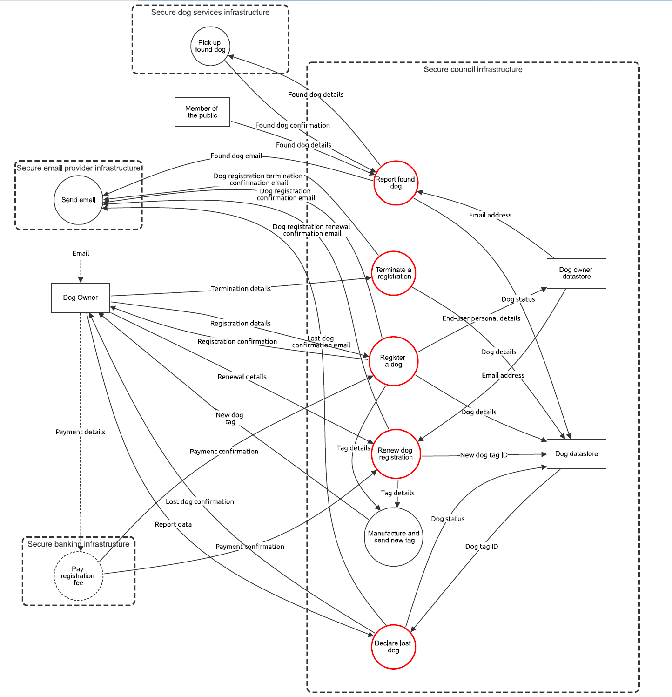
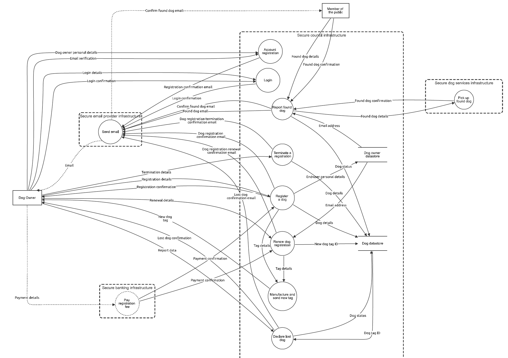

# Threat Model Information - Council Dog App
Application Version: 1.0  
Description: A web-based application designed to register dogs in order to get their identification tags, as well as the management and traceability of dogs. As this is the first implementation of the website, the functionality will be limited. There will be three users of the application:  

- Dog Owners  
- Members of The Public  
- Council Employee

Document Owner: Fabian Gilson

Participants: James Suddaby, Kane Xie, Daniel Cha, Mohammad Munem 

Reviewer: Morgan English 

Doc: [Google Docs](https://docs.google.com/document/d/1W-bBLjRRvqJhG1ZdiYmg6vr-C4ri-5ngK66otZvr2jM/edit?usp=sharing)  

Report: To generate the diagram, load to the [json file](ThreatDragonModels/Assignment2/seng406_asg2_group2.json) to [Threat Dragon](https://www.threatdragon.com/#/dashboard)

PDF: [Final report](ThreatDragonModels/Assignment2/seng406_asg2_group2.pdf)

# Original System Data Flow Diagram

# Improved System Data Flow Diagram

